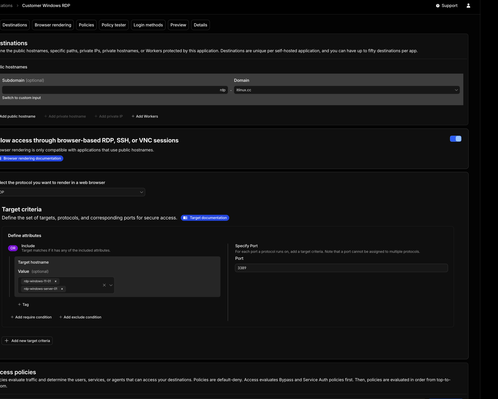
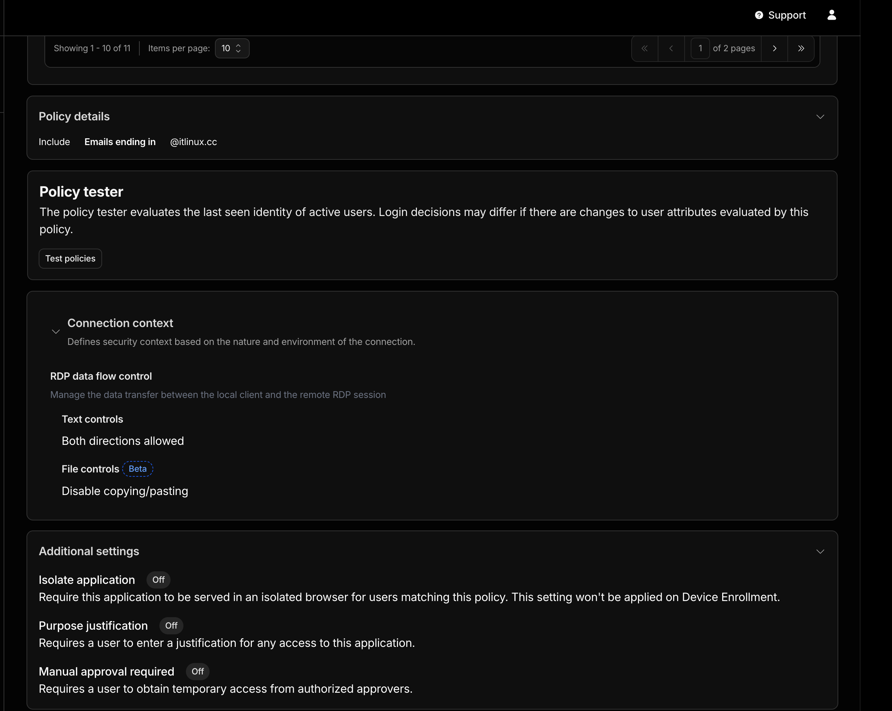
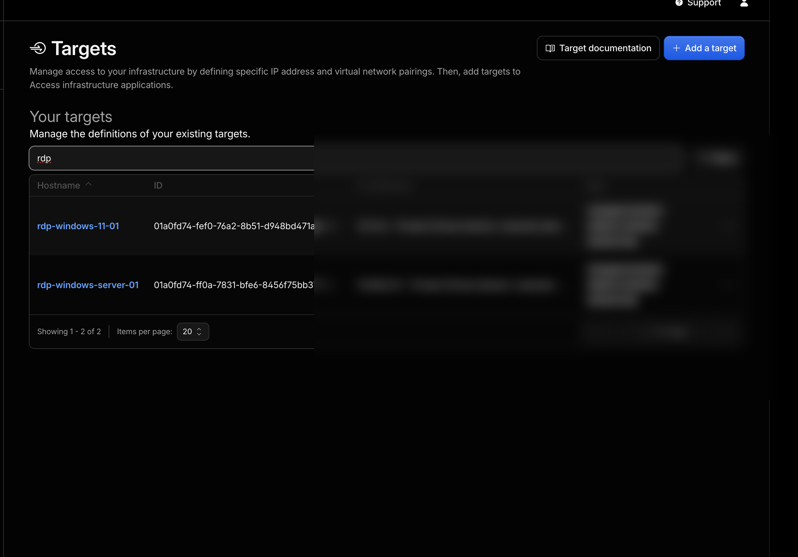
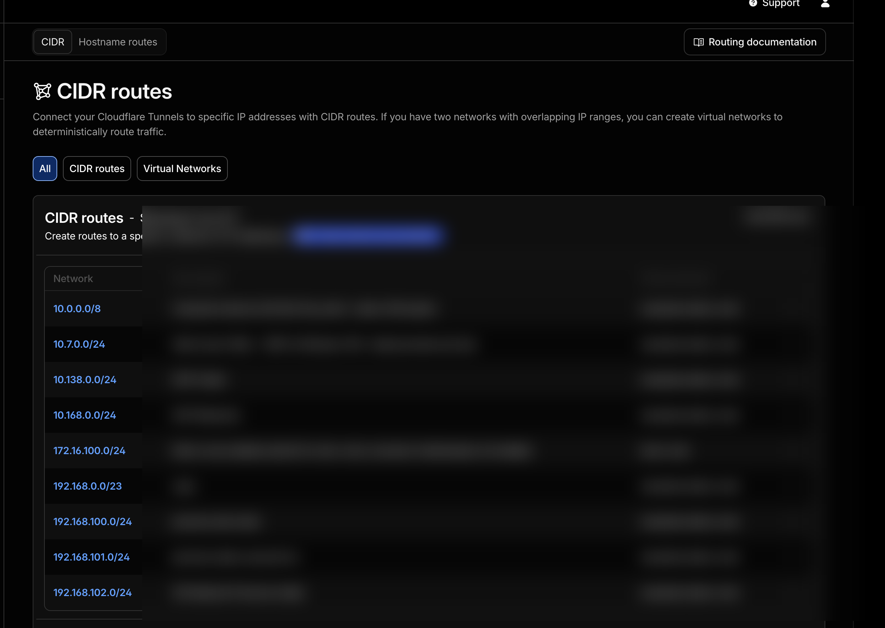
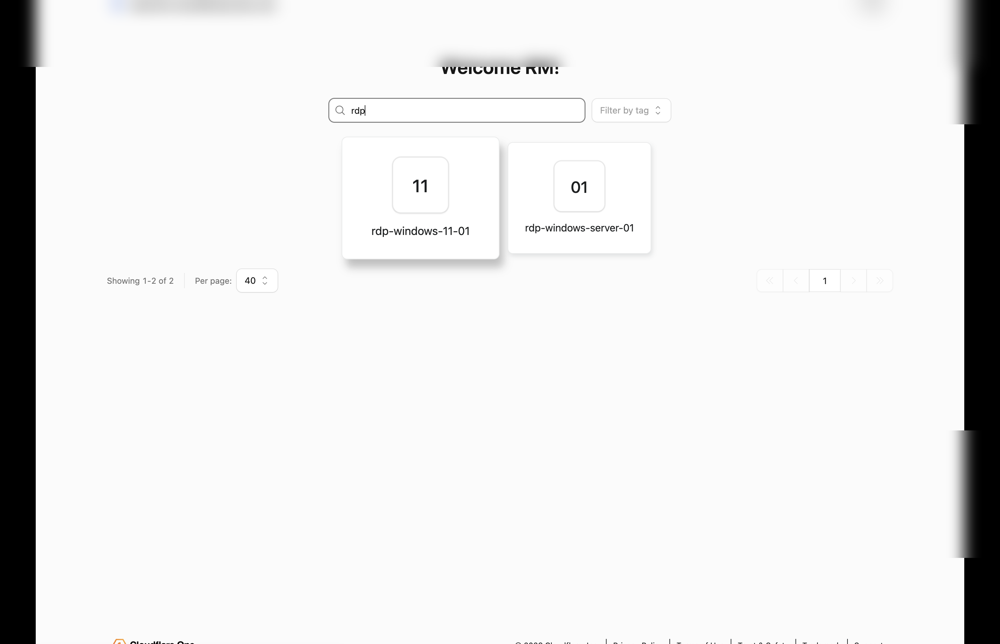
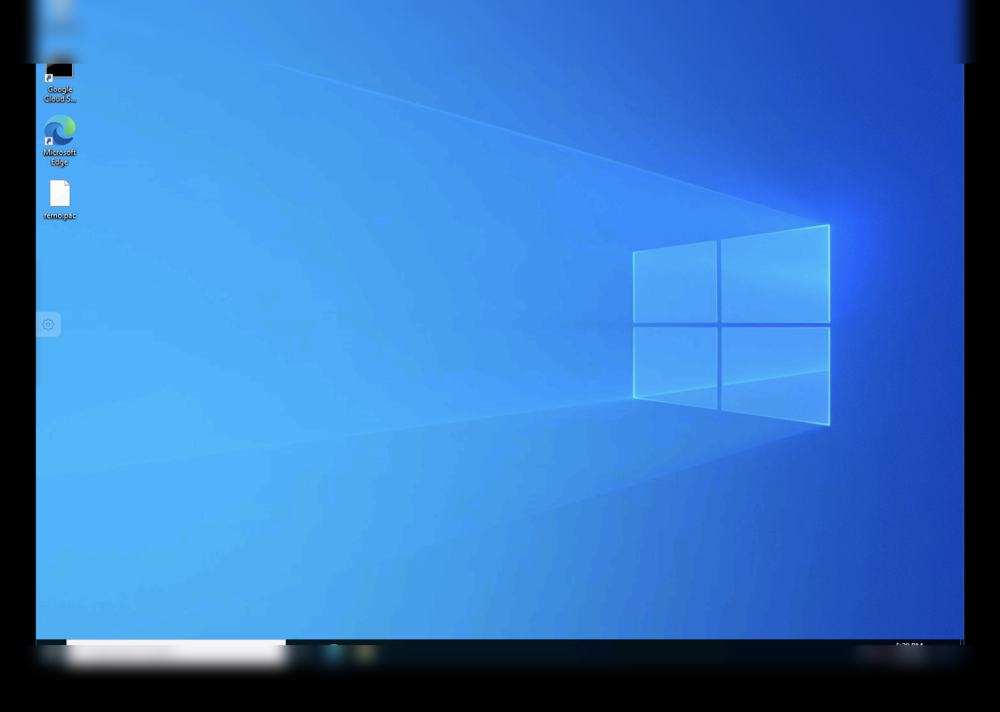

# Windows Access Config

Terraform for browser-based RDP to a Windows server through Cloudflare Access and a Cloudflare Tunnel private route.

```text
User browser
    │ Entra ID authentication + Access authorization
    ▼
rdp.example.com (proxied DNS + Access)
    │ browser RDP proxy
    ▼
Cloudflare Tunnel private route / virtual network
    │ TCP 3389
    ▼
Windows target 10.168.0.27
```

The repository uses maps of reusable access profiles and Windows servers. Add servers without duplicating policy code; servers that select the same profile share one browser-RDP application and authorization policy.

## What it looks like

The screenshots below show the finished administrator configuration and clientless browser-RDP experience. Deployment-specific identifiers and unrelated environment details are redacted.

### Cloudflare Access application



### Access policy



### Infrastructure targets and tags



### Private routes and Cloudflare virtual network



### Clientless RDP target picker

Clientless users see the `rdp-` target names; infrastructure-target tags remain administrative metadata.



### Browser RDP session



## Creates

- One Access infrastructure target per `files/ips/windows-targets.json` entry.
- One browser-rendered RDP Access application per `rdp_access_profiles` entry.
- One Entra-only login method with instant authentication.
- One Entra email/UPN or security-group allow policy.
- One proxied placeholder DNS A record (`240.0.0.0`) unless disabled.
- Clipboard transfer disabled in both directions by default.

## Prerequisites

1. A Cloudflare Tunnel already connected to the target network.
2. A private-network route covering every address in `files/ips/windows-targets.json`, assigned to the selected Cloudflare virtual network.
3. TCP 3389 reachable from the `cloudflared` connector to the Windows host.
4. RDP enabled on an Entra-joined Windows host. Cloudflare Access authenticates and authorizes the user at the edge, but Windows still performs a second authentication using that user's Entra-backed Windows credential.
5. A Cloudflare zone for `application_domain`.
6. A Cloudflare API token stored as `cloudflare_api_token` in the local, Git-ignored `terraform.tfvars`, with:
   - Account — Access: Apps and Policies — Edit
   - Account — Access: Organizations, Identity Providers, and Groups — Read (Edit only if this project creates the Entra IdP)
   - Account — Cloudflare Tunnel — Read (and Edit if you manage routes separately)
   - Zone — DNS — Edit

## Configure

```sh
cp terraform.tfvars.example terraform.tfvars
```

Set the values in `terraform.tfvars`. Every access profile requires either exact Entra emails or Entra group Object IDs; there is no permissive domain-wide default.

### Multiple servers and reusable access profiles

`files/ips/windows-targets.json` is the compact name-to-IP inventory for Windows Server and Windows desktop systems. Add or remove an entry in this file:

```json
{
  "windows_server_01": "10.168.0.27",
  "windows_11_01": "10.7.0.6"
}
```

`windows-targets.tf` contains only locals. It loads the complete map, converts underscores in each stable name to hyphens, and prefixes the visible Cloudflare target hostname with `rdp-`. For example, `windows_11_01` becomes `rdp-windows-11-01`. This gives clientless users visible RDP-prefixed names even though the clientless picker does not render target tags. All input variables remain centralized in `variables.tf`. Shared VNet and access-profile defaults are declared once. Optional keyed variables override the VNet or access profile only for exceptional targets. No resource duplication is required, and IPs never go in `terraform.tfvars`.

Names must be unique and should remain stable after creation. Renaming a map key changes the Terraform resource address, so add a `moved` block before applying a rename to preserve the existing target.

Every target receives searchable tags by default:

```hcl
protocol = "rdp"
platform = "windows"
managed  = "terraform"
```

Filtering infrastructure targets by the `protocol=rdp` tag returns all RDP targets. On a device enrolled in the Cloudflare One Client/WARP organization, list the authorized tagged targets with:

```sh
warp-cli target list --attribute protocol=rdp
```

This command applies to WARP-based Infrastructure Access target discovery. Clientless browser-RDP users instead open the RDP Access application and select one of its explicitly named targets. Add target-specific metadata through `windows_target_tags`; those values merge with the shared defaults.

`rdp_access_profiles` remains in the ignored `terraform.tfvars` because it contains deployment-specific customer authorization. It defines the reusable authorization boundary: application hostname, allowed Entra groups/users, RDP ports, and clipboard controls.

The checked-in inventory includes two RFC 1918 private targets. Replace them when adapting the repository to another environment. Both select `operators`, so Terraform creates two targets but only one Access application. To give a customer different users, hostname, or clipboard controls, add another profile and point that customer's targets at it. For 100–1,000 users, use `allowed_group_ids`; do not enumerate users in Terraform.

### Create the Terraform API token

This is a required pre-setup step. Each operator running Terraform needs a Cloudflare API token created by a user that already has permission to administer the selected account and zone. An API token cannot grant privileges that its creator does not have.

1. Sign in to the Cloudflare dashboard as that user.
2. Open **My Profile → API Tokens**, or go directly to <https://dash.cloudflare.com/profile/api-tokens>.
3. Select **Create Token → Create Custom Token**.
4. Name it `windows-access-config-terraform`.
5. Add these permissions:

   | Scope | Permission | Level | Why |
   | --- | --- | --- | --- |
   | Account | Access: Apps and Policies | Edit | Create and update the browser-RDP app, policies, and infrastructure targets |
   | Account | Access: Organizations, Identity Providers, and Groups | Read | Read the existing Entra identity provider used by the app |
   | Account | Cloudflare Tunnel | Read | Resolve and verify Cloudflare virtual networks and private routes |
   | Zone | DNS | Edit | Create the proxied placeholder record for the RDP hostname |

   If `manage_entra_idp = true`, change **Access: Organizations, Identity Providers, and Groups** from **Read** to **Edit**. This repository does not create Tunnel routes, so **Cloudflare Tunnel Edit** is unnecessary unless route management is added later.

6. Under **Account Resources**, select **Include → Specific account →** the account identified by `account_id`.
7. Under **Zone Resources**, select **Include → Specific zone →** the zone identified by `zone_id`.
8. Optionally set an expiry. Add source-IP filtering only if every machine that runs Terraform has a predictable egress IP.
9. Select **Continue to summary → Create Token**.
10. Copy the token immediately; Cloudflare displays it only once.

Store it in the local, Git-ignored `terraform.tfvars`:

```hcl
cloudflare_api_token = "<token>"
```

Copy `terraform.tfvars.example` to `terraform.tfvars` and replace the placeholder. The provider also supports `CLOUDFLARE_API_TOKEN` for CI/automation, but the documented local workflow for this repository uses the ignored tfvars file. Do not use a Global API Key, share one personal token among users, commit the token, or copy a token from another account without checking its resource scopes.

Verify that the token is active before running Terraform:

```sh
export CLOUDFLARE_API_TOKEN='<token>'
curl -fsS \
  -H "Authorization: Bearer $CLOUDFLARE_API_TOKEN" \
  https://api.cloudflare.com/client/v4/user/tokens/verify
unset CLOUDFLARE_API_TOKEN
```

The response must contain `"success": true` and `"status": "active"`. This verifies validity and expiry, not every permission; `terraform plan` remains the functional scope check. Before committing, confirm `git check-ignore terraform.tfvars` succeeds.

Cloudflare reference: <https://developers.cloudflare.com/fundamentals/api/get-started/create-token/>

### Where each value comes from

| Variable | What it is | Where to find it |
| --- | --- | --- |
| `cloudflare_api_token` | Cloudflare API credential used by Terraform | **My Profile → API Tokens**; save it only in the Git-ignored `terraform.tfvars` |
| `account_id` | Cloudflare account that owns Zero Trust, the Tunnel route, Entra IdP, and Access app | Cloudflare dashboard URL after `dash.cloudflare.com/`, or **Account home → Account ID** |
| `zone_id` | Cloudflare zone that owns `application_domain` | **Websites → your zone → Overview → Zone ID** |
| `rdp_access_profiles` | Reusable app/policy definitions | Choose one application hostname and Entra authorization boundary per profile |
| `files/ips/windows-targets.json` | IP-only Windows RDP target inventory | Add each Windows Server or Windows desktop private IP |
| `default_windows_target_virtual_network_id` | Default **Cloudflare Zero Trust virtual-network UUID** containing the Tunnel routes to the targets | **Zero Trust → Networks → Routes**; locate the route covering each target IP. This is not an Azure VNet ID, Azure subscription ID, GCP VPC ID, or Proxmox network name |
| `existing_entra_idp_id` | Existing Cloudflare Access Microsoft Entra IdP UUID | **Zero Trust → Integrations → Identity providers → Entra ID**; use the UUID from the edit-page URL or API response |
| `rdp_access_profiles[*].allowed_emails` | Exact Entra users authorized by a profile | Use each user's Entra email/UPN as returned by the configured email claim |
| `rdp_access_profiles[*].allowed_group_ids` | Preferred production authorization | Microsoft Entra admin center → **Identity → Groups → All groups → group → Object ID** |

### Find the Cloudflare virtual network correctly

The target and route must use the same Cloudflare virtual network. A virtual network copied from an unrelated Azure or Proxmox project will produce a valid Terraform plan but an unreachable RDP target.

1. In Cloudflare Zero Trust, open **Networks → Routes**.
2. Find a CIDR route containing each Windows IP. An exact `/32` route or a containing subnet is valid.
3. Confirm the route points to a healthy Tunnel whose connector can reach the Windows host on TCP `3389`.
4. Copy that route's Cloudflare virtual-network UUID into `default_windows_target_virtual_network_id`, or use `windows_target_virtual_network_ids` for exceptions.
5. If no route covers the IP, create one first. Prefer the narrowest suitable CIDR.

API lookups, when the token has **Cloudflare Tunnel Read**:

```sh
# List virtual networks and their UUIDs.
curl -fsS \
  -H "Authorization: Bearer $CLOUDFLARE_API_TOKEN" \
  "https://api.cloudflare.com/client/v4/accounts/$ACCOUNT_ID/teamnet/virtual_networks"

# Resolve the route Cloudflare would use for the target IP.
curl -fsS \
  -H "Authorization: Bearer $CLOUDFLARE_API_TOKEN" \
  "https://api.cloudflare.com/client/v4/accounts/$ACCOUNT_ID/teamnet/routes/ip/$TARGET_IP"
```

If a sibling Terraform project owns the route, its state exposes the same value:

```sh
terraform state show <route-resource-address>
# Read: virtual_network_id = "..."
```

If the matching route uses the account's default Cloudflare virtual network, `virtual_network_id` may be omitted. Do not omit it merely because Azure calls the source network a VNet.

### Verify the network before applying

From the Tunnel connector or another machine on the connector network, verify the origin path:

```powershell
Test-NetConnection <TARGET_IP> -Port 3389
```

Also confirm that the target IP falls inside the selected route. Terraform validates UUID syntax and resource schema; it cannot prove that a connector can reach the server.

By default, this project reuses an existing Cloudflare Access Entra IdP. Set its ID:

```hcl
existing_entra_idp_id = "<CLOUDFLARE_ENTRA_IDP_ID>"
```

The application is always pinned to that Entra IdP and uses instant authentication. To authorize an Entra security group instead of individual users, set its Object ID:

```hcl
rdp_access_profiles = {
  operators = {
    application_name   = "RDP - Windows Machines"
    application_domain = "rdp.example.com"
    allowed_group_ids  = ["<ENTRA_SECURITY_GROUP_OBJECT_ID>"]
  }
}
```

Group authorization requires **Support groups** on the Cloudflare Entra integration and the Microsoft Graph permissions documented by Cloudflare. SCIM is recommended for readable group names and deprovisioning but is not required when using Object IDs.

To create a new Entra integration in this project instead, set `manage_entra_idp = true` and supply `entra_client_id`, `entra_client_secret`, and `entra_directory_id` in the ignored `terraform.tfvars`. The Entra redirect URI is `https://<team-name>.cloudflareaccess.com/cdn-cgi/access/callback`.

If the DNS records already exist, set `create_dns_records = false` and import/manage the records separately.

## Deploy

```sh
terraform init
terraform fmt -check
terraform validate
terraform plan
terraform apply
```

No API token is stored in Terraform files. The real `terraform.tfvars`, state, plans, and `.env` are ignored.

## Connect and verify

1. Open the Zero Trust App Launcher: `https://<team-name>.cloudflareaccess.com`.
2. Authenticate with Entra. Access must identify the user by a value in the selected profile's `allowed_emails`, or the user must belong to one of its `allowed_group_ids`.
3. Select the Windows target tile.
4. Enter `AzureAD\\user@example.com` or `AzureAD\\user`. The browser initiates RDP and Windows prompts for that user's Entra password.

Verify the connector can reach the target before troubleshooting Access.

From Windows PowerShell:

```powershell
Test-NetConnection <TARGET_IP> -Port 3389
```

From macOS or Linux:

```sh
nc -vz <TARGET_IP> 3389
```

Run the test from a host on the connector network. A test from an unrelated network does not prove that the Cloudflare Tunnel connector can reach the target.

## Security notes

- Do not expose TCP 3389 directly to the Internet; route the private address through Cloudflare Tunnel.
- New RDP policies deny clipboard transfer by default here. Add only the required text clipboard formats after reviewing the data-loss risk.
- Browser RDP does not support file transfer, audio, or local printing.
- Cloudflare Access Entra authentication does **not** pass the Access token into Windows and is not passwordless Windows SSO. It is the first gate; Windows Entra authentication is the second gate.
- Entra-joined Windows hosts require disabling enforcement of NLA for browser RDP because PKU2U is not supported. Disable only NLA; keep the RDP security layer at **Negotiate** or **SSL/TLS**, never legacy RDP security.

Cloudflare reference: https://developers.cloudflare.com/cloudflare-one/networks/connectors/cloudflare-tunnel/use-cases/rdp/rdp-browser/
